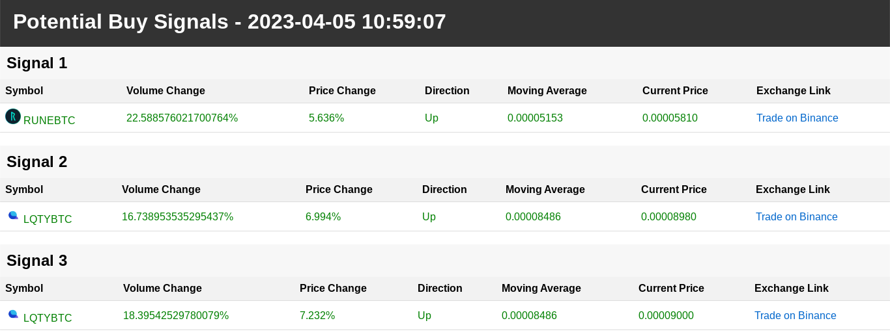

# Binance Volume Increase Detector
This is a Python script that fetches 24-hour ticker data from Binance API and filters the symbols with potential volume increase based on a minimum volume increase percentage. It then prints the symbols with potential volume increase and waits for a specified time interval before fetching the data again.

## Getting Started
### Prerequisites
To use this script, you will need:

Python 3 installed on your system

### Installation

1. Clone the repository

2. Install the required Python packages:

`pip install requests`

### Usage
To run the script, navigate to the cloned directory and run the following command:

`python3 volume.py`

The script will fetch 24-hour ticker data from the Binance API and filter the symbols with potential volume increase based on a minimum volume increase percentage (which is set to 10% by default). It will then print the symbols with potential volume increase and wait for a specified time interval (which is set to 60 seconds by default) before fetching the data again.

### Contributing
Pull requests are welcome. For major changes, please open an issue first to discuss what you would like to change.

